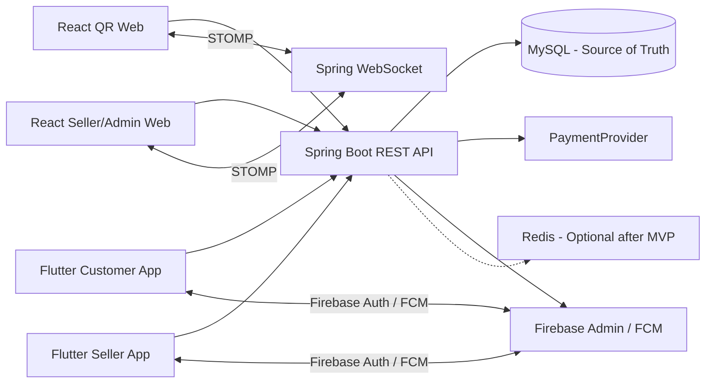
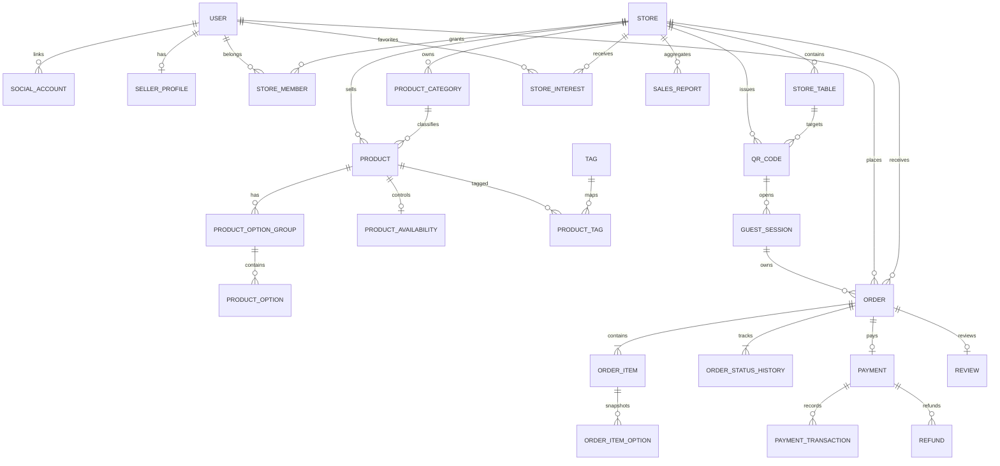

# POPQ 초기 요구사항 및 아키텍처 기준안

- 작성일: 2026-07-29
- 상태: 구현 전 검토안
- 기준 자료:
  - `reference/스토리보드.pdf`
  - `reference/설계용ERD.png`
  - `reference/발표용ERD_디자인.png`
  - `reference/기술스택 및 서비스 아키텍처.pdf`
  - 프로젝트 첨부 지침
- 원칙: 이 문서가 승인되기 전에는 애플리케이션 구현을 시작하지 않는다.

## 1. 스토리보드 요구사항 분석

### 1.1 비회원 QR 주문 웹

고객은 앱 설치와 로그인 없이 `/q/{opaqueToken}`으로 진입한다.

1. QR 토큰 검증
2. 스토어 또는 테이블 식별
3. 메뉴와 판매 가능 상태 조회
4. 옵션 선택과 장바구니 편집
5. 서버 기준 금액 재계산
6. 테스트 결제
7. 주문 완료와 공개 주문번호 표시
8. WebSocket/STOMP 기반 주문 상태 추적
9. 판매자 접수 전 취소

스토리보드에는 주류 주문 시 신분증 촬영 흐름이 포함되어 있다. 인증 수단, 보관 범위, 외부 인증 사업자가 확정되지 않았으므로 기본 MVP 범위에는 아직 포함하지 않는다.

### 1.2 Flutter 회원용 소비자 앱

- Google/Kakao/Naver 등 소셜 로그인
- 위치 권한과 알림 권한
- 위치·지도·키워드·태그 기반 스토어 탐색
- 관심 스토어
- 상품·옵션·장바구니·결제
- 주문 내역과 FCM 알림
- 리뷰와 마이페이지

Flutter 알림은 상태 원본이 아니다. FCM 수신 후 REST API로 최신 주문을 재조회한다.

### 1.3 React 판매자 웹 및 Flutter 판매자 앱

- 판매자 로그인과 사업자/행사 판매자 등록
- 담당 스토어 선택
- 스토어 정보와 영업 상태
- 카테고리·상품·옵션·판매 가능 상태
- QR 생성·재발급·폐기
- 신규 주문 알림
- 접수·거절·준비·완료
- 취소와 환불
- 공지·고객 소통
- 매출·정산·분석

MVP에서는 React 판매자 웹을 우선 구현한다. Flutter 판매자 앱, 채팅, 정산 상세는 후속 단계다.

### 1.4 관리자

- 사용자·판매자·스토어 조회
- 주문·결제·환불 조회
- 판매자와 스토어 이용 제한
- 비정상 결제와 보상 처리 조회
- 감사 로그 조회

별도 여섯 번째 앱은 만들지 않는다. 관리자 화면이 필요하면 React 판매자 웹 내부의 역할 분리 모듈로 구현한다.

## 2. 기존 ERD 적합성 평가

기존 ERD의 다음 구조는 서비스 핵심과 잘 맞는다.

- `users`, `stores`, `products`
- `tags`, `product_tags`
- `orders`, `order_items`
- `payments`, `reviews`
- `store_interests`, `notifications`, `sales_reports`
- `LOCAL_STORE`, `EVENT_COMMERCE` 구분

그러나 현재 ERD만으로 실제 주문 서비스를 안전하게 구현할 수는 없다.

| 문제 | 영향 | v2 대응 |
|---|---|---|
| `users.role` 하나로 플랫폼 역할과 스토어 권한 표현 | 여러 스토어 담당과 권한 분리 불가 | `StoreMember` 추가 |
| `orders.user_id` 필수 구조 | 비회원 주문 소유권 표현 불가 | nullable 회원과 `GuestSession` 연결 |
| 상품 옵션 구조 없음 | 옵션 검증과 가격 계산 불가 | 옵션 그룹·옵션 추가 |
| 주문 시점 스냅샷 부족 | 상품 변경 시 과거 주문 왜곡 | `OrderItem`, `OrderItemOption` 스냅샷 |
| 주문 현재 상태만 존재 | 변경 원인과 이력 감사 불가 | `OrderStatusHistory` 추가 |
| 결제 한 행만 존재 | 승인·실패·취소·환불 요청 이력 부족 | `PaymentTransaction`, `Refund` 추가 |
| QR 엔티티 없음 | 비활성화·만료·재발급 통제 불가 | `QrCode` 추가 |
| `stores.owner_id` 중심 | 공동 운영과 직원 권한 불가 | `StoreMember`로 이관 |
| `products.category` 문자열 | 스토어별 순서와 관리 불가 | `ProductCategory` 추가 |
| 매출 집계의 원본 관계 불명확 | 재집계와 검증 곤란 | 주문·결제 원본 기반 집계 |

평가 결론은 “핵심 명칭과 관계는 유지하되 운영에 필요한 관계를 확장”이다.

## 3. 기존 ERD 유지 항목과 변경 항목

### 3.1 유지

- 기존 핵심 테이블 명칭
- `Product`, `StoreInterest`, `StoreTable`, `SalesReport` 명칭
- `Store.storeType`: `LOCAL_STORE`, `EVENT_COMMERCE`
- 사용자-스토어 관심등록 관계
- 스토어-상품 1:N
- 주문-주문상품 1:N
- 주문-결제 기본 1:1
- 주문-리뷰 최대 1:1

### 3.2 확장

- 인증: `SocialAccount`, `SellerProfile`
- 권한: `StoreMember`
- 카탈로그: `ProductCategory`, `ProductOptionGroup`, `ProductOption`, `ProductAvailability`
- QR: `QrCode`, `GuestSession`
- 주문: `OrderItemOption`, `OrderStatusHistory`
- 결제: `PaymentTransaction`, `Refund`
- 운영: `AuditLog`
- 2차: `ReviewImage`, `Announcement`, `Settlement`
- 3차: `Conversation`, `Message`

### 3.3 마이그레이션 대상

- `stores.owner_id`는 기존 소유자를 `StoreMember(OWNER)`로 이관한 뒤 호환 기간을 거쳐 제거한다.
- `products.category`는 `ProductCategory`로 백필한 뒤 FK로 전환한다.
- `orders.user_id`는 비회원 주문을 위해 nullable로 변경하고 `guest_session_id`를 추가한다.
- 기존 `orders.status`, `payments.status` 값은 신규 enum으로 매핑한다.
- 기존 금액 컬럼은 KRW 정수 원 단위 정책으로 통일하는 것을 권장한다.

## 4. 사용자 역할과 권한표

플랫폼 역할과 스토어 역할을 분리한다.

| 기능 | 비회원 | CUSTOMER | STAFF | MANAGER | OWNER | ADMIN |
|---|---:|---:|---:|---:|---:|---:|
| QR 메뉴 조회·주문 | O | O | O | O | O | O |
| 본인 주문 조회 | 세션 소유 주문 | O | O | O | O | O |
| 관심 스토어·리뷰 | X | O | O | O | O | O |
| 담당 스토어 주문 조회 | X | X | O | O | O | O |
| 주문 접수·상태 변경 | X | X | 정책별 O | O | O | O |
| 상품 판매 상태 변경 | X | X | 정책별 O | O | O | O |
| 상품·옵션 구조 변경 | X | X | X | O | O | O |
| 스토어 정보 변경 | X | X | X | O | O | O |
| 멤버·권한 관리 | X | X | X | X | O | O |
| 환불 실행 | X | X | X | 정책별 O | O | O |
| 정산 정보 조회 | X | X | X | 정책별 O | O | O |
| 플랫폼 제재·감사로그 | X | X | X | X | X | O |

`STAFF`와 `MANAGER`의 세부 권한은 단순 enum만으로 충분한지 MVP 도중 검증한다. 초기에는 역할별 고정 정책을 사용한다.

## 5. MVP·2차·3차 개발 범위

### MVP

- Spring Boot 공통 API 기반
- 판매자 인증과 내부 토큰
- 사용자·판매자·스토어·StoreMember
- 카테고리·상품·옵션·판매 가능 상태
- QR 발급·검증·폐기와 GuestSession
- 비회원 QR 웹
- TestPaymentProvider
- 주문·결제·환불 기본 구조
- 판매자 주문 처리
- WebSocket/STOMP
- 기본 관리자 조회
- 기본 매출 집계
- 보안·권한·멱등성 필수 테스트

### 2차

- Flutter 소비자 앱
- Flutter 판매자 앱
- Firebase Authentication/FCM
- 지도·위치·검색·관심 스토어
- 리뷰·리뷰 이미지
- 공지
- 기본 정산

### 3차

- 실제 PG사와 웹훅
- 부분 환불과 보상 재처리 자동화
- 상세 정산·매출 분석
- 채팅
- 사업자·성인 인증
- 추천
- Event/Booth 확장 검토
- Transactional Outbox, Redis, 다중 서버

## 6. 전체 애플리케이션 구성도



React는 STOMP, Flutter는 FCM을 사용한다. 주문·결제의 최종 상태는 항상 Spring Boot와 MySQL이 관리한다.

## 7. 전체 화면 목록

### React QR 웹

1. QR 확인/오류
2. 스토어·테이블 안내
3. 상품 목록
4. 상품 상세·옵션
5. 장바구니
6. 결제
7. 결제 처리
8. 주문 완료
9. 주문 상태
10. 주문 취소 확인
11. 일회용 주문 접근 토큰 교환

### React 판매자·관리자 웹

1. 판매자 로그인
2. 스토어 선택
3. 스토어 등록·수정
4. 운영 대시보드
5. 영업 상태
6. 카테고리
7. 상품·옵션·판매 가능 상태
8. QR 관리
9. 주문 목록·상세
10. 주문 처리
11. 환불
12. 알림·공지
13. 매출 요약
14. 정산
15. 멤버·권한
16. 관리자 사용자·판매자·스토어
17. 관리자 주문·결제·보상 처리
18. 감사 로그

### Flutter 소비자 앱

1. 스플래시·온보딩
2. 소셜 로그인
3. 위치·알림 권한
4. 홈
5. 지도·키워드·태그 검색
6. 스토어 상세
7. 상품·옵션
8. 장바구니·결제
9. 주문 내역·상태
10. 관심 스토어
11. 리뷰
12. 마이페이지

### Flutter 판매자 앱

1. 로그인·권한
2. 스토어 선택
3. 운영 현황
4. 영업 상태
5. 상품·품절
6. 신규 주문
7. 주문 처리
8. 알림
9. 기본 매출
10. 마이페이지

## 8. 화면별 입력값·출력값·사용자 액션

| 화면/기능 | 입력 | 출력 | 주요 액션 |
|---|---|---|---|
| QR 확인 | opaqueToken | QR·스토어·테이블 상태 | 세션 생성, 메뉴 진입 |
| 상품 목록 | QR 컨텍스트, 카테고리 | 판매 가능 상품 | 검색, 카테고리 이동 |
| 상품 상세 | productId | 가격·옵션·품절 | 옵션 선택, 담기 |
| 장바구니 | 수량·선택 옵션 | 서버 재계산 예상액 | 수정, 삭제, 주문 준비 |
| 결제 | 주문 요청, idempotencyKey | 결제 요청 정보 | 결제 승인 요청 |
| 주문 완료 | orderPublicId | 주문번호·금액·상태 | 상태 화면 이동 |
| 주문 상태 | orderPublicId, 세션 쿠키 | 이력·현재 상태 | 접수 전 취소, 재조회 |
| 판매자 로그인 | OAuth2 인증 응답 | 내부 토큰·사용자 | 스토어 선택 |
| 스토어 관리 | 이름·유형·주소·시간 | 스토어 상세 | 등록, 수정, 영업 상태 |
| 카테고리 | 이름·표시 순서 | 카테고리 목록 | 추가, 정렬, 비활성 |
| 상품 관리 | 기본정보·이미지·가격 | 상품 상세 | 등록, 수정, 품절 |
| 옵션 관리 | 그룹·선택수·옵션가격 | 옵션 구조 | 추가, 정렬, 비활성 |
| QR 관리 | 대상 스토어/테이블·만료 | QR 이미지·상태 | 발급, 재발급, 폐기 |
| 판매자 주문 | 상태·스토어 필터 | 주문 목록·상세 | 접수, 거절, 준비, 완료 |
| 환불 | 주문·금액·사유 | 환불 상태 | 요청, 재조회 |
| 매출 | 스토어·기간 | 주문수·매출·취소 | 기간 변경, 재집계 |
| 권한 관리 | 사용자·스토어 역할 | 멤버 목록 | 초대, 역할 변경, 해제 |
| 소비자 검색 | 위치·키워드·태그 | 스토어 목록·지도 | 상세, 관심 등록 |
| 리뷰 | 주문·평점·내용·이미지 | 리뷰 상세 | 작성, 수정, 삭제 |
| 관리자 조회 | 조건·페이지 | 사용자·주문·결제 | 제한, 상세, 감사 확인 |

모든 화면은 로딩, 빈 데이터, 네트워크 오류, 인증 오류, 권한 오류 상태를 별도로 제공한다.

## 9. 주문 상태 전이표

| 현재 | 액션/조건 | 다음 | 주체 |
|---|---|---|---|
| CREATED | 결제 승인 성공 | PLACED | 시스템 |
| CREATED | 결제 유효시간 만료 | EXPIRED | 시스템 |
| PLACED | 주문 접수 | ACCEPTED | 판매자 |
| PLACED | 주문 거절 | REJECTED | 판매자 |
| PLACED | 접수 전 취소 | CANCELED | 고객 |
| ACCEPTED | 준비 시작 | PREPARING | 판매자 |
| PREPARING | 준비 완료 | READY | 판매자 |
| READY | 수령/완료 | COMPLETED | 판매자 |

종료 상태는 `CANCELED`, `REJECTED`, `COMPLETED`, `EXPIRED`다. 종료 상태에서는 다른 상태로 전이할 수 없다. 모든 전이는 `Order.version` 낙관적 잠금과 허용 전이 검증을 거치며 `OrderStatusHistory`와 같은 트랜잭션에서 저장한다.

## 10. 결제 및 환불 상태 전이표

### Payment

| 현재 | 조건 | 다음 |
|---|---|---|
| READY | 승인 요청 시작 | IN_PROGRESS |
| IN_PROGRESS | 승인 성공·금액 일치 | PAID |
| IN_PROGRESS | 승인 실패 | FAILED |
| PAID | 전액 취소 성공 | CANCELED |
| PAID | 부분 환불 성공 | PARTIALLY_REFUNDED |
| PAID | 전액 환불 성공 | REFUNDED |
| PARTIALLY_REFUNDED | 추가 부분 환불 | PARTIALLY_REFUNDED |
| PARTIALLY_REFUNDED | 누적 전액 환불 | REFUNDED |

### Refund

`REQUESTED → PROCESSING → SUCCEEDED | FAILED`

각 PG 요청·응답은 `PaymentTransaction`에 별도 기록한다. 결제 승인 성공 후 주문 확정 실패는 보상 처리 대상으로 기록한다.

## 11. 핵심 유스케이스

1. 활성 QR 진입과 GuestSession 발급
2. 스토어·테이블 컨텍스트가 고정된 메뉴 조회
3. 서버 검증 기반 옵션 선택과 금액 계산
4. idempotencyKey 기반 주문 생성
5. 테스트 결제 승인 후 `CREATED → PLACED`
6. 판매자 신규 주문 수신과 접수
7. 고객의 PLACED 상태 주문 취소
8. 판매자 거절과 전액 환불
9. 준비·완료 상태 실시간 전파
10. QR 재발급 후 기존 토큰 거부
11. 스토어 권한 범위 내 상품·주문 관리
12. 비회원 주문 소유권 검증
13. 결제 성공/주문 확정 실패 보상 기록
14. 원본 주문·결제로부터 SalesReport 재집계

## 12. ERD v2 초안

### 핵심 관계



`QrCode`는 `store_id`를 필수로 갖고 `store_table_id`는 LOCAL_STORE의 테이블 QR일 때만 갖는다. EVENT_COMMERCE는 MVP에서 스토어 단위 QR만 사용한다.

## 13. 테이블별 핵심 컬럼과 제약조건

| 테이블 | 핵심 컬럼 | 핵심 제약 |
|---|---|---|
| users | user_id, email, name, phone, role, status | email 선택적 UQ, role/status enum |
| social_accounts | provider, provider_user_id, user_id | UQ(provider, provider_user_id) |
| seller_profiles | user_id, verification_status | UQ(user_id) |
| stores | store_id, store_type, name, status, business_status | store_type/status enum |
| store_members | store_id, user_id, role, status | UQ(store_id, user_id) |
| store_tables | store_id, table_code, name, status | UQ(store_id, table_code) |
| product_categories | store_id, name, display_order, status | UQ(store_id, name) |
| products | store_id, category_id, name, base_price, status | base_price >= 0 |
| product_option_groups | product_id, name, min_select, max_select, required | min/max 검증 |
| product_options | option_group_id, name, additional_price, status | 그룹 내 이름 UQ 검토 |
| product_availability | product_id, sold_out, start_at, end_at, channel | UQ(product_id) 또는 채널별 UQ |
| tags | name, tag_type | UQ(name, tag_type) |
| product_tags | product_id, tag_id | UQ(product_id, tag_id) |
| qr_codes | store_id, store_table_id, token_hash, status, expires_at | UQ(token_hash) |
| guest_sessions | qr_code_id, session_hash, expires_at, last_seen_at | UQ(session_hash) |
| orders | order_id, order_public_id, user_id, guest_session_id, store_id, status, total_amount, idempotency_key, version | UQ(order_public_id), UQ(idempotency_key), user/guest 중 하나 |
| order_items | order_id, product_id, product_name_snapshot, unit_price_snapshot, quantity, item_total_price | quantity > 0 |
| order_item_options | order_item_id, product_option_id, option_group_name_snapshot, option_name_snapshot, option_price_snapshot | 스냅샷 필수 |
| order_status_histories | order_id, previous_status, current_status, actor_type, actor_id, reason, changed_at | 허용 전이만 저장 |
| payments | order_id, provider, requested_amount, approved_amount, status, provider_payment_key, idempotency_key | UQ(order_id), UQ(idempotency_key), provider key UQ |
| payment_transactions | payment_id, transaction_type, request_payload, response_payload, status, occurred_at | 민감정보 마스킹 |
| refunds | payment_id, amount, reason, requester_type, requester_id, status, provider_refund_key | amount > 0 |
| reviews | order_id, user_id, store_id, rating, content | UQ(order_id), rating 1..5 |
| store_interests | user_id, store_id | UQ(user_id, store_id) |
| notifications | user_id, type, target_type, target_id, title, message, is_read | 사용자 조회 인덱스 |
| sales_reports | store_id, report_date, total_order_count, total_sales_amount, total_cancel_amount, net_sales_amount | UQ(store_id, report_date) |
| audit_logs | actor_id, action, target_type, target_id, before_data, after_data, occurred_at | 수정 금지 정책 |
| review_images | review_id, image_url, display_order | 리뷰별 순서 인덱스 |
| announcements | store_id, title, content, status, published_at | 스토어·게시 상태 인덱스 |
| settlements | store_id, period_start, period_end, gross_amount, fee_amount, settlement_amount, status | UQ(store_id, period_start, period_end) |
| conversations | store_id, customer_id, status, blocked_at | 참여자·스토어 조회 인덱스 |
| messages | conversation_id, sender_id, content, sent_at, read_at | 대화방·시간 인덱스 |

공통 시간은 DB에 UTC로 저장한다. 운영 로그에는 토큰, 비밀번호, 결제 원문 민감정보를 저장하지 않는다.

## 14. API 명세 초안

기본 응답은 `data`, `error`, `meta`, `traceId`를 갖는 공통 구조로 통일한다.

### 인증

| Method | Path | 설명 |
|---|---|---|
| GET | `/api/v1/auth/oauth2/{provider}` | 판매자 웹 로그인 시작 |
| POST | `/api/v1/auth/firebase/exchange` | Firebase ID Token 교환 |
| POST | `/api/v1/auth/refresh` | Access Token 갱신 |
| POST | `/api/v1/auth/logout` | Refresh Token 폐기 |
| GET | `/api/v1/auth/me` | 현재 사용자 |

### QR·비회원

| Method | Path | 설명 |
|---|---|---|
| POST | `/api/v1/qr/{token}/sessions` | QR 검증·GuestSession 생성 |
| GET | `/api/v1/qr/context` | 현재 QR 스토어·테이블 컨텍스트 |
| GET | `/api/v1/qr/products` | 판매 가능한 상품 |
| GET | `/api/v1/qr/products/{productId}` | 상품·옵션 |
| POST | `/api/v1/qr/orders` | 비회원 주문 생성 |
| POST | `/api/v1/qr/orders/{orderPublicId}/payments/confirm` | 테스트/PG 승인 |
| GET | `/api/v1/qr/orders/{orderPublicId}` | 세션 소유 주문 조회 |
| POST | `/api/v1/qr/orders/{orderPublicId}/cancel` | 접수 전 취소 |
| POST | `/api/v1/qr/order-access/{oneTimeToken}` | 다른 기기 접근 토큰 교환 |

### 스토어·상품

| Method | Path | 설명 |
|---|---|---|
| GET/POST | `/api/v1/seller/stores` | 담당 스토어 목록/등록 |
| GET/PATCH | `/api/v1/seller/stores/{storeId}` | 상세/수정 |
| PATCH | `/api/v1/seller/stores/{storeId}/business-status` | 영업 상태 |
| GET/POST | `/api/v1/seller/stores/{storeId}/members` | 멤버 목록/초대 |
| PATCH/DELETE | `/api/v1/seller/stores/{storeId}/members/{memberId}` | 권한 변경/해제 |
| GET/POST | `/api/v1/seller/stores/{storeId}/categories` | 카테고리 |
| GET/POST | `/api/v1/seller/stores/{storeId}/products` | 상품 |
| GET/PATCH/DELETE | `/api/v1/seller/stores/{storeId}/products/{productId}` | 상품 상세 관리 |
| PUT | `/api/v1/seller/stores/{storeId}/products/{productId}/options` | 옵션 구조 저장 |
| PATCH | `/api/v1/seller/stores/{storeId}/products/{productId}/availability` | 품절·판매 가능 |
| GET/POST | `/api/v1/seller/stores/{storeId}/qr-codes` | QR 목록/발급 |
| POST | `/api/v1/seller/stores/{storeId}/qr-codes/{qrId}/reissue` | 재발급 |
| POST | `/api/v1/seller/stores/{storeId}/qr-codes/{qrId}/revoke` | 폐기 |

### 주문·결제·매출

| Method | Path | 설명 |
|---|---|---|
| GET | `/api/v1/seller/stores/{storeId}/orders` | 주문 목록 |
| GET | `/api/v1/seller/stores/{storeId}/orders/{orderId}` | 주문 상세 |
| POST | `/api/v1/seller/stores/{storeId}/orders/{orderId}/accept` | 접수 |
| POST | `/api/v1/seller/stores/{storeId}/orders/{orderId}/reject` | 거절 |
| POST | `/api/v1/seller/stores/{storeId}/orders/{orderId}/prepare` | 준비 시작 |
| POST | `/api/v1/seller/stores/{storeId}/orders/{orderId}/ready` | 준비 완료 |
| POST | `/api/v1/seller/stores/{storeId}/orders/{orderId}/complete` | 완료 |
| POST | `/api/v1/seller/stores/{storeId}/orders/{orderId}/refunds` | 환불 요청 |
| GET | `/api/v1/seller/stores/{storeId}/sales-summary` | 기본 매출 |

### 회원 앱·관리자

| Method | Path | 설명 |
|---|---|---|
| GET | `/api/v1/app/stores` | 위치·키워드·태그 검색 |
| GET | `/api/v1/app/stores/{storeId}` | 스토어 상세 |
| GET/POST/DELETE | `/api/v1/app/store-interests/**` | 관심 스토어 |
| GET | `/api/v1/app/orders` | 회원 주문 내역 |
| GET/POST | `/api/v1/app/reviews/**` | 리뷰 |
| POST | `/api/v1/app/devices` | FCM 토큰 등록 |
| GET | `/api/v1/admin/users` | 사용자 조회 |
| GET | `/api/v1/admin/stores` | 스토어 조회 |
| GET | `/api/v1/admin/orders` | 주문 조회 |
| GET | `/api/v1/admin/payments` | 결제·보상 조회 |
| GET | `/api/v1/admin/audit-logs` | 감사 로그 |

화면 URL과 API URL은 분리한다. 상태 변경은 일반 `PATCH status` 대신 의미가 분명한 명령형 endpoint를 우선 사용한다.

## 15. WebSocket/STOMP 및 FCM 이벤트 명세

### STOMP

- 연결: `/ws`
- 판매자 구독: `/topic/stores/{storeId}/orders`
- 비회원 주문 구독: `/user/queue/orders/{orderPublicId}`
- 인증/인가: 연결 시 토큰 또는 세션 검증, 구독 대상 권한 재검증

### 공통 이벤트

| 필드 | 설명 |
|---|---|
| eventId | 이벤트 중복 판별 ID |
| eventType | `ORDER_PLACED` 등 |
| orderId | 내부 주문 ID 또는 공개 ID 정책에 맞춘 값 |
| storeId | 대상 스토어 |
| previousStatus | 이전 상태 |
| currentStatus | 최신 상태 |
| occurredAt | UTC 발생 시각 |
| version | 주문 낙관적 잠금 버전 |

이벤트 유형:

- `ORDER_PLACED`
- `ORDER_CANCELED`
- `ORDER_ACCEPTED`
- `ORDER_REJECTED`
- `ORDER_PREPARING`
- `ORDER_READY`
- `ORDER_COMPLETED`
- `PAYMENT_PAID`
- `PAYMENT_FAILED`
- `REFUND_SUCCEEDED`
- `REFUND_FAILED`
- `ORDER_EXPIRED`

이벤트는 `AFTER_COMMIT`에서만 발행한다. 클라이언트는 `eventId`와 `version`으로 중복·역순 이벤트를 무시하고 재접속 시 REST로 복구한다.

현재 스프린트 5에서는 `ORDER_*` 이벤트를 구현했다. 결제·환불 이벤트는 외부 PG 연동 및 보상 재처리 단계에서 추가한다.

## 16. 인증 흐름

### Flutter

1. Firebase Authentication 소셜 로그인
2. Firebase ID Token 획득
3. `/api/v1/auth/firebase/exchange` 호출
4. Firebase Admin SDK 검증
5. `SocialAccount`와 `User` 연결
6. 내부 Access/Refresh Token 발급
7. Access Token은 Authorization 헤더, Refresh Token은 보안 저장소

### React 판매자 웹

1. Spring Security OAuth2 Login 시작
2. 공급자 callback 검증
3. `SocialAccount`와 `User` 연결
4. Access Token은 메모리, Refresh Token은 Secure/HttpOnly/SameSite 쿠키
5. 변경 요청에는 확정된 CSRF 정책 적용

### 비회원 QR 웹

1. QR 토큰 검증
2. GuestSession 생성
3. 서명·무작위 세션 값은 Secure/HttpOnly/SameSite 쿠키로 전달
4. `orderPublicId`와 GuestSession 소유 관계를 함께 검증
5. 다른 기기 접근은 단기 one-time token 교환

## 17. 프로젝트 디렉터리 구조

사용자가 정한 세 기술 루트를 유지하면서 다섯 애플리케이션을 내부에서 분리한다.

```text
project_popq/
├─ backend_spring/
│  ├─ src/main/java/.../
│  │  ├─ auth/
│  │  ├─ user/
│  │  ├─ seller/
│  │  ├─ store/
│  │  ├─ product/
│  │  ├─ qr/
│  │  ├─ order/
│  │  ├─ payment/
│  │  ├─ notification/
│  │  ├─ analytics/
│  │  ├─ admin/
│  │  └─ common/
│  └─ src/main/resources/db/migration/
├─ web_react/
│  ├─ popq/
│  └─ seller-web/
├─ mobile_flutter/
│  ├─ customer-app/
│  └─ seller-app/
├─ infrastructure/
│  ├─ docker/
│  ├─ nginx/
│  ├─ mysql/
│  └─ firebase/
├─ docs/
│  ├─ planning/
│  ├─ erd/
│  ├─ api/
│  └─ architecture/
├─ reference/
└─ docker-compose.yml
```

현재 `web_react/popq`는 QR 고객 주문 Vite 앱, `web_react/seller-web`은 판매자 운영 Vite 앱으로 사용한다. `web_react` 루트 CRA 앱은 참고용으로 보존하며 삭제·이동은 사용자 확인 후 진행한다.

## 18. 데이터베이스 마이그레이션 순서

Flyway를 사용하고 운영에서는 `ddl-auto=validate`를 적용한다.

1. V1: 사용자·소셜계정·판매자 프로필·스토어·멤버·테이블
2. V2: 카테고리·상품·옵션·판매 가능 상태·태그·QR·GuestSession
3. V3: 주문·주문상품·옵션 스냅샷·상태 이력·결제·결제 트랜잭션·환불
4. V4: 관심 스토어·알림·감사 로그
5. V5: 매출 리포트와 재집계 인덱스
6. V6: 개발용 최소 seed

기존 운영 데이터가 있다면 먼저 백업하고 `owner_id → StoreMember`, 문자열 카테고리 → 카테고리 FK, 기존 상태 enum 매핑을 별도 마이그레이션으로 수행한다.

## 19. 스프린트별 구현 계획

| 스프린트 | 목표 | 완료 조건 | 상태 |
|---|---|---|---|
| 0 | 결정사항·환경·저장소 정리 | 앱 역할, DB, 프로파일, CI 기준 확정 | 진행 중 |
| 1 | 백엔드 기반 | 공통 응답·예외·Security·Flyway·User/Store 권한 테스트 | 완료 |
| 2 | 카탈로그·QR | 상품/옵션/재고, QR·GuestSession 보안 테스트 | 완료 |
| 3 | 주문 | 스냅샷·금액 계산·멱등성·상태 이력 테스트 | 완료 |
| 4 | 결제·환불 | TestPaymentProvider, 보상 기록, 중복 승인 테스트 | 완료 |
| 5 | 실시간 | STOMP 인가, AFTER_COMMIT, 재접속 복구 | 완료 |
| 6 | React QR 웹 | 모바일 우선 전체 주문 흐름과 Vitest/Playwright | 완료 |
| 7 | React 판매자 웹 | 스토어·상품·주문·QR·기본 관리자 | 완료 |
| 8 | 통합·배포 | Docker Compose, Nginx, CORS/CSRF, E2E | 완료 |
| 9+ | 2차 Flutter | 소비자 앱 후 판매자 앱, Firebase/FCM | 진행 중 |

각 스프린트는 백엔드 테스트 → 해당 클라이언트 테스트 → 계약/통합 테스트 순으로 검증한다.

- 웹 MVP 이후 작업은 [`WEB_FOLLOW_UP_BACKLOG.md`](./WEB_FOLLOW_UP_BACKLOG.md)에 동결한다.
- Flutter 소비자 앱 우선 구현은 [`FLUTTER_PHASE9_PLAN.md`](./FLUTTER_PHASE9_PLAN.md)의 9.0부터 진행한다.

## 20. 기술적 위험과 해결 방법

| 위험 | 대응 |
|---|---|
| CRA와 Vite 앱 중복 | 정식 앱 역할 확정 후 Vite 기반 두 앱으로 분리 |
| 하나의 Flutter 앱만 존재 | customer/seller 앱을 별도 패키지로 분리 |
| DB 비밀번호 소스 포함 | 환경변수·프로파일·`.env.example`로 전환 |
| `ddl-auto=update` | Flyway + `validate` |
| 비회원 주문 탈취 | GuestSession, 공개 ID, 소유 관계, one-time token |
| QR 무차별 대입 | 128비트 이상 토큰, 해시 저장, rate limit |
| 금액 위변조 | 서버 재계산, KRW 정수, 승인 금액 대조 |
| 중복 주문·결제 | MySQL 고유키 기반 멱등성 |
| 동시 주문 상태 변경 | optimistic lock와 허용 전이 검증 |
| 커밋 전 알림 | `TransactionalEventListener(AFTER_COMMIT)` |
| WebSocket 유실/역순 | version 비교와 REST 복구 |
| 판매자 데이터 누출 | 모든 쿼리에 StoreMember 범위 검증 |
| 결제 성공·주문 실패 | 보상 상태와 재처리 운영 화면 |
| 로컬 업로드 경로 | 저장소 추상화와 환경별 구현 |
| Spring Boot 4/신규 라이브러리 호환 | 의존성 고정과 컴파일·통합 테스트 |

## 21. 아직 결정이 필요한 질문 목록

확정된 기술 분리, MySQL 원본성, React STOMP, Flutter FCM, EVENT_COMMERCE, Booth 제외, 핵심 엔티티 명칭, 상태 분리, Redis 선택 사항은 다시 질문하지 않는다.

1. 현재 `web_react/popq`를 QR 웹으로 사용할지, 판매자 웹으로 사용할지?
2. 기존 CRA 앱은 삭제해도 되는지, 참고용으로 보존할지?
3. 실제 운영 데이터베이스나 보존해야 할 데이터가 있는지?
4. MVP 판매자 로그인 공급자를 Google/Kakao/Naver 모두 지원할지, 우선 하나만 지원할지?
5. 스토리보드의 주류 주문·성인 인증을 MVP에 포함할지?
6. 관리자 UI를 판매자 웹 내부에 포함할지, MVP에서는 API만 만들지?
7. 기존 `order_type`의 `STORE`를 `DINE_IN` 의미로 유지할지, enum을 변경할지?
8. KRW 금액을 `BIGINT` 정수 원 단위로 확정해도 되는지?
9. 상품/사업자 이미지 저장소를 로컬, S3 호환 저장소, 특정 클라우드 중 무엇으로 할지?
10. 사업자 인증을 MVP에서 관리자 수동 승인으로 처리할지?
11. 개발·테스트 MySQL의 DB명, 계정, 포트를 현재 값과 다르게 구성할지?
12. 배포 도메인을 QR 웹과 판매자 웹의 서브도메인으로 분리할지?

## 현재 구현 상태

- 스프린트 1~4 백엔드 구현과 H2/MySQL 호환 Flyway 검증 완료
- 서버 기준 주문 금액 계산, 상품·옵션 스냅샷, 주문·결제 멱등성 구현
- TestPaymentProvider 승인/실패와 고객 취소·판매자 거절 환불 구현
- 주문 이벤트 `AFTER_COMMIT` 발행, STOMP 인가, REST 재동기화 계약 구현 완료
- `web_react/popq`를 QR 주문 웹으로 확정하고 데모/실제 API 이중 모드 구현
- 메뉴·옵션·장바구니·결제·STOMP 추적 및 REST 복구의 React 1차 흐름 구현
- 장바구니·진행 주문 새로고침 복구, 재시도 멱등성 키 유지, 고객 주문 취소와 종료 상태 UI 구현
- React 단위·컴포넌트·API 계약 테스트 6개와 모바일 Playwright E2E 2개 통과
- React lint와 production build 통과
- `web_react/seller-web` 판매자 앱 분리와 주문 운영 대시보드 1차 구현 완료
- 판매자 주문 목록·상세·필터·상태 변경, REST/STOMP 연결 계층, 데모 모드 구현
- 판매자 상품 검색·카테고리·품절·채널별 판매 상태 관리 구현
- 테이블 QR 목록·발급·만료·중지·재활성화·폐기와 실제 QR PNG 다운로드 구현
- 상품 요약 API에 판매 기간과 QR 웹·고객 앱 채널 상태를 추가해 안전한 부분 변경 보장
- 완료 전환 시각 기준 7일·30일 순매출·일별 추이·이용 유형·인기 상품 집계 API/UI 구현
- 스토어 영업 상태와 테이블 추가 운영 설정 구현
- 판매자 카테고리·상품 생성과 옵션 그룹·옵션 전체 편집 UI/API 구현
- 판매자 전용 상품 상세 조회 API와 스토어 멤버 권한 검증 추가
- 완료 주문 결제·환불 이력 조회와 OWNER/MANAGER 전액 환불 운영 구현
- 중복·권한·금액 환불 검증 및 환불 완료 주문 순매출 제외 구현
- ADMIN 전용 사용자·판매자 인증·스토어 현황 조회와 상태 변경 API/UI 구현
- 관리자 자기 계정 보호와 비관리자 접근 차단 구현
- 판매자 앱 단위·컴포넌트·API 계약 테스트 24개, Spring 전체 테스트 39개, lint/production build 통과
- 7단계 React 판매자 웹과 8단계 Docker Compose·CORS/CSRF·통합 E2E 범위를 완료했다.
- MySQL·Spring Boot·QR 웹·판매자 웹 통합 Docker Compose와 서비스별 헬스체크 구현
- Nginx SPA·REST·WebSocket 프록시, 업로드 크기와 기본 보안 헤더 구성
- REST CORS와 STOMP Origin을 QR·판매자 웹 Origin으로 제한하고 공개 Actuator health 계약 추가
- Docker Compose config 검증, Spring 전체 테스트 45개, QR 웹 6개·E2E 2개, 판매자 웹 24개 통과
- Flutter 3.44.6 의존성 복구, 정적 분석 무결점과 위젯 테스트 1개 통과
- Docker 29.5.2에서 MySQL·Spring Boot·QR 웹·판매자 웹 이미지를 실제 빌드하고 모든 서비스의 헬스체크 통과를 확인
- 실제 MySQL 기반으로 판매자 생성 → 매장·상품·QR 발급 → 게스트 주문·결제 → 판매자 접수 → 게스트 재동기화 E2E 통과
- REST CORS와 STOMP WebSocket 업그레이드는 허용 Origin에서 `200`·`101`, 비허용 Origin에서 모두 `403`을 확인
- 개발 프로파일도 `POPQ_DEV_LOGIN_ENABLED=false`를 우선하도록 보강하고 비활성 경로의 `404` 계약을 회귀 테스트로 고정
- Flutter 9.0에서 소비자·판매자 Android/iOS 앱과 `app_core`·`design_system` 공유 패키지를 분리하고 네 프로젝트 analyze 및 테스트 6개 통과
- Flutter 9.1에서 URL 라우팅·인증 가드·보안 세션·Bearer API 클라이언트·비동기 상태 UI를 구현하고 테스트 14개 및 두 Android APK 빌드 통과
- Flutter 9.2에서 온보딩·위치/알림 권한·공개 매장 위치/키워드/태그 검색·상세를 구현하고 Spring 전체 회귀 테스트, Flutter 테스트 16개 및 소비자 Android APK 빌드 통과
- Flutter 9.3에서 공개 상품·옵션, 단일 스토어 장바구니, 회원 주문·테스트 결제·멱등성 재시도·버전 동기화를 구현하고 Spring 테스트 50개, Flutter 테스트 17개 및 소비자 Android APK 빌드 통과
- Flutter 9.4에서 관심 스토어, 완료 주문당 1개 리뷰, 공개 리뷰, 마이페이지 집계·수정·삭제를 구현하고 Spring 테스트 51개, Flutter 테스트 19개 및 소비자 Android APK 빌드 통과
- Flutter 9.5 기반에서 기기 토큰·주문 알림 내역·읽음 상태·알림 배지·주문 딥링크를 구현하고 Spring 테스트 52개, Flutter 테스트 20개 및 소비자 Android APK 빌드 통과. 실제 FCM 송수신은 Firebase 프로젝트 설정 대기
- Flutter 9.6A에서 판매자 전용 세션·역할 재검증·스토어 선택·계정 전환 정리를 구현하고 Spring 테스트 53개, Flutter 테스트 23개 및 판매자 Android APK 빌드 통과
- Flutter 9.6B에서 선택 스토어 주문 목록·필터·상세·버전 동기화와 접수·거절·준비·완료 상태 전이를 구현하고 타 스토어 주문 격리를 검증해 Spring 테스트 53개, Flutter 테스트 25개 및 판매자 Android APK 빌드 통과
- 상위 CRA 루트 앱은 참고용으로 보존하고 `web_react/popq`는 QR 주문 웹, `web_react/seller-web`은 판매자 웹으로 사용한다.
